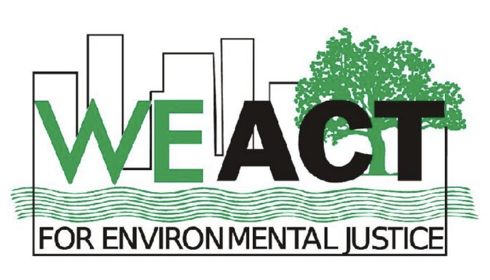

```{r, echo = FALSE, message = FALSE}
library(tidyverse)
```


Air pollution exposure represents a significant source of hospital admissions and morbidity in urban populations. Policy measures, such as the Clean Air Act, have resulted in the reduction of air pollution levels and implementation of regular monitoring systems; however, contaminants remain at harmful levels. Communities of color often experience disparities in exposure to such pollutants due to closer proximity to emission sources. In New York City, areas of high poverty, including Northern Manhattan and the South Bronx, experience higher rates of particulate matter 2.5 (PM2.5) related hospital admissions compared to low poverty areas such as Midtown Manhattan (NYC DOHMH, 2011). Further, the quality and quantity of air pollution monitors is not uniform across the city. Understanding the scope of pollution, limitations in monitoring, and where to target interventions is paramount to protecting the health of vulnerable communities. 


# Air Quality Monitoring in New York City

To understand the scope of pollutant levels, multiple air quality monitoring systems are used. At the regulatory level, the Environmental Protection Agency (EPA) maintains data from monitoring sites in locations across the country that measure ambient air pollution. These sites are primarily owned and operated by state environmental agencies that regularly send measurements of pollutant concentrations to the EPA’s Air Quality System (AQS) and the AirData database. In addition to regular monitoring data, emissions data from vehicles, power plants, and industries are reported to the EPA from environmental agencies. In New York City, state monitoring sites are supplemented by both local monitors maintained by the New York City Department of Health and a growing market of low-cost monitors intended for personal use.

While these sources all report pollutant concentrations, the quality of data collection varies significantly. For instance, sites used for federal monitoring collect data at frequent intervals including multiple times an hour while the New York City Community Air Survey (NYCCAS) collects data in 2-week periods each season. Low-cost systems may only provide data when the user turns on their system. Additionally, there are only a few regulatory monitoring sites across the entire city. Therefore, coverage for neighborhoods can vary significantly based on sensor placement.

# General Health Impacts and Air Pollutants {.tabset .tabset-fade }

## General Health Impacts
The continuous finding about air pollutants is that they contribute to increased mortality and increased hospital admissions (Kampa & Castanas, 2008). Typically, people are not exposed to a single pollutant but rather a mixture of pollutants (Kampa & Castanas, 2008). As a result, the health effects can range from nausea to cancer. The respiratory and cardiovascular systems are the common systems affected by air pollution (Kampa & Constansas, 2008). Other severe effects from pollutants include birth defects, developmental delays, and a reduced activity of the immune response (Kampa & Constansas, 2008). 	

## Particulate Matter 
Particulate matter 2.5 (PM2.5) consists of a mixture of microscopic solid and liquid droplets in air that are 2.5 mm or less in width. PM2.5 is emitted outside from car exhausts and the burning of fuels such as coal and forest fires, but it can also form droplets in the environment when reacting with gas from a power plant. Inside sources of PM2.5 include cigarette smoke, cooking, and burning candles or fireplaces. PM2.5 can travel long distances away from its source, and due to this, New York measures the amount of particulate matter coming in with the wind from other states. The short-term air quality standard for PM2.5 is 35 µg/m3. Elevated levels of PM2.5 in the outdoors will cause foggy air, which occurs when the air outside is stagnant and the particles are not being distributed by wind (New York State, 2018). 
	
Particulate matter is particularly harmful to the lungs. The short-term health impacts of PM2.5 include sneezing, coughing, eye irritation, and shortness of breath. Studies have shown that chronic exposure can lead to heightened respiratory hospital admissions and may exacerbate asthma severity. Children, elders, and individuals with respiratory diseases are sensitive populations to PM2.5 (New York State, 2018).
	
## Black Carbon 
Black carbon is short-lived particulate matter that forms alongside carbon dioxide, carbon monoxide, and other volatile organic compounds during combustion of fossil fuels (U.N.E.P., 1970a). Black carbon is formed by the incomplete combustion of fossil fuels and wood, whereas complete combustion leads to formation of soot. It is a major contributor to climate change, and due to this issue, many developed countries have set tight air quality regulations. Developing countries with looser regulations are still being largely exposed to black carbon because of their household cooking and heating styles. Black carbon has a 460-1,500 times stronger warming impact on the climate than carbon dioxide, although it only lasts in the air for an average of 4-12 days. This warming effect can be attributed to black carbon’s ability to absorb light and in turn heat its surroundings. When suspended in air, black carbon can influence rainfall patterns and cloud formations. When resting on ice or snow, it will prevent sunlight reflection and cause melting of the surface (U.N.E.P., 1970a). 
	
Black carbon is a component of particulate matter, so the health risks impact similar regions of the body. Premature death has been recorded in adults with lung and heart disease. Other health effects include stroke, chronic respiratory disease, severe asthma, and heart attacks. In extreme cases, premature death is a result for children with acute lower respiratory infection (U.N.E.P., 1970a). 
	
## Ozone 
Ozone is a very reactive gas that is not produced through emissions, but through the interaction of sunlight with volatile organic compounds and nitrogen oxides. These chemicals are emitted by man-made sources such as fossil fuel power plants and vehicles. In the stratosphere (the upper layer of the atmosphere), ozone acts as a protectant from the sun’s ultraviolet radiation. In the troposphere (at ground level), ozone becomes a greenhouse gas that can manifest as urban smog. In urban settings, ozone can linger in the air for several weeks. Tropospheric ozone is classified as an air pollutant and greenhouse gas because it impacts evaporation, precipitation, melting, and warming of the planet (U.N.E.P., 1970b). Healthy air quality index values for ozone are <100. Values between 100-150 are risky for sensitive populations and values above 150 are dangerous for everyone. Ozone will be most abundant in the air during the afternoon when sunlight is the strongest. Similar to particulate matter, ozone can be carried by the wind from heavily urbanized areas to more rural regions (EPA, 2022). 
	
In the stratosphere, ozone reduces exposure to UV radiation that causes skin cancer in humans. Ozone is especially detrimental to the lungs. Ozone can reach the lower respiratory tract and reacts with chemicals of the airway lining fluid in the respiratory system. Health effects include shortness of breath, pain or irritation of the chest when taking deep breaths, and wheezing. Children, especially those with asthma, are more susceptible to ozone because they spend more time outdoors (EPA, 2022). 


# Maps

# Dashboard
[Interact with the maps](https://vasudakapoor.shinyapps.io/EHS_capstone_project/)

# Data Sources
- [AirData](link.com)
- [PurpleAir](link.com)

